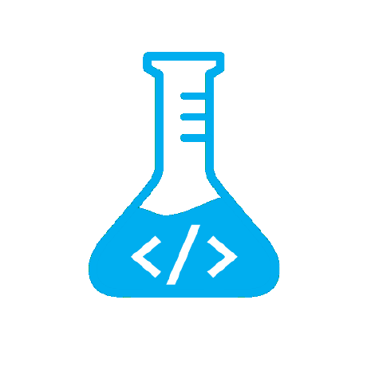

# LUKB DevLab macOS Installer

This public repo helps installing some macOS tools for frontend- & app development and is maintained by the LUKB DevLab team.



## Requirements

- macOS hardware
- macOS user account with admin privileges
- Terminal
- Internet connection
- Xcode-Tools installed:

```bash
# Open a Terminal and install Xcode Tools for git
    sudo xcode-select --install
```

## Installation

To use the main `install.sh` script, do the following steps:

```bash
# Open Terminal

# Create new folder called 'Projects'
mkdir -p ~/Projects

# Navigate in the new folder
cd ~/Projects

# Clone this repo
git clone https://github.com/luzernerkb/macOS_Installer.git

# Change directory
cd macOS_Installer

# Run the main script an follow the on-screen instructions
./install.sh

```

## 🚧 Work in progress

- [ ] `setupUser.sh` check if config file already exists, if yes load it
- [ ] Tool to dump the OS'x settings or load them again (Or to automate Firewall on ...)
- [ ] Network-Share helper for Sidemenu
